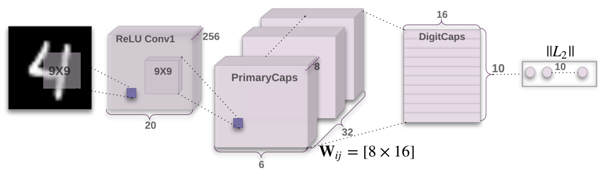
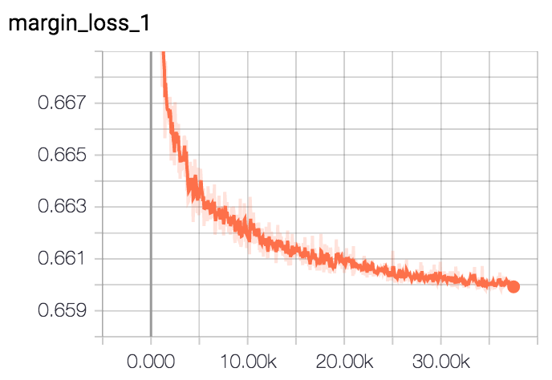
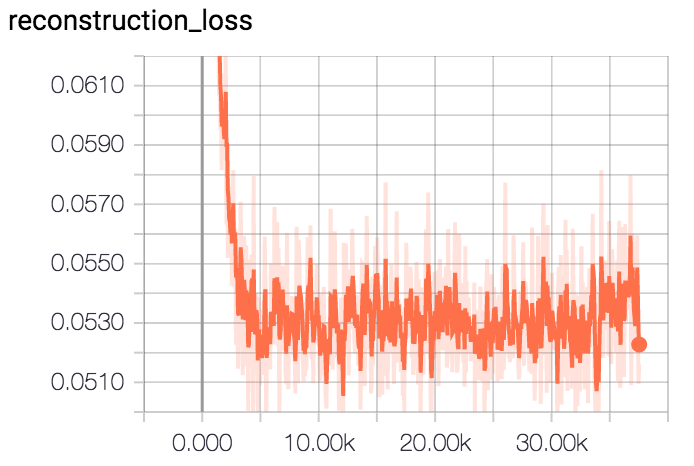
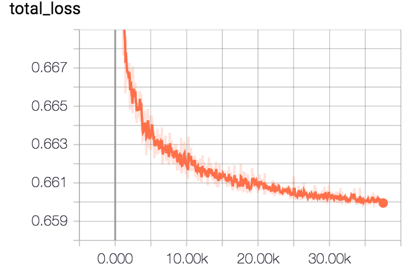

# A Tensorflow implementation of Capsule networks

## Requirements
  * tensorflow >= 1.4 (Probably 1.3 should work, too, though I didn't test it)
  * numpy
  * pillow
  * scipy

## Capsule network
I tried to implement the idea in [Dynamic Routing Between Capsules](https://arxiv.org/abs/1710.09829)


## File description
  * `config.py` includes all hyper parameters that are needed.
  * `utils.py` contains functions regarding loading and saving.
  * `model.py` has all building blocks for capsNet and whole model implementation.
  * `train.py` is for training.
  * `eval.py` is for evaluation.
  
## Usage
### Training
```
$ python train.py
```
### Evaluation
```
$ python eval.py
```

## Training
  


## Result
### Classification
| Epoch     | 10     |
|-----------|--------|
| Test Acc. | 99.278 |

### Reconstruction
   
